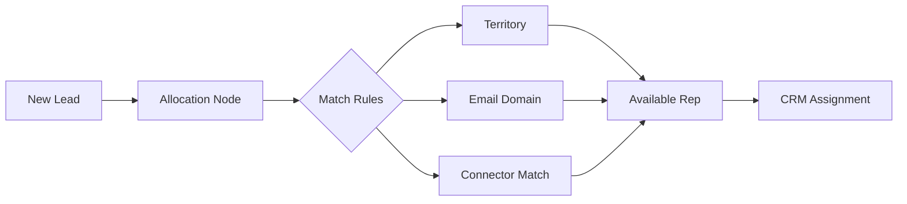

Revenue Organization in Cargo provides a complete system for managing your sales team structure and automating lead distribution. It keeps your team hierarchy synchronized with your CRM while giving you fine-grained control over how leads flow to the right reps.

---

## Core concepts

Revenue Organization consists of three interconnected components that work together to route leads intelligently:

| Concept        | Description                                                                                        |
| -------------- | -------------------------------------------------------------------------------------------------- |
| **Members**    | Your sales team imported from connected CRMs, enriched with custom metadata like languages and specializations. |
| **Territories**| Logical groupings of members by region, vertical, or segment—each with optional fallback assignments. |
| **Capacities** | Workload limits that ensure fair distribution and prevent rep overload.                            |

---

## How it works

1. **Leads enter** through a play trigger
2. **Matching rules** determine which reps are eligible
3. **Capacity checks** filter to available team members
4. **Round-robin** distributes evenly among eligible reps
5. **Assignment syncs** back to your CRM

---

## Key features

| Feature | Description |
| --- | --- |
| **CRM sync** | Team members automatically import and stay synchronized with Salesforce, HubSpot, or other connected CRMs |
| **Territory routing** | Route leads based on geographic regions, industry verticals, or company size segments |
| **Capacity management** | Set daily, weekly, or custom limits per rep to balance workloads |
| **Fallback rules** | Ensure every lead gets assigned, even when primary routing fails |
| **Allocation history** | Full audit trail of every assignment with links to the triggering play run |
| **Model-based capacity** | Calculate availability from real pipeline data like open deals |

---

## When to use Revenue Organization

<AccordionGroup>
  <Accordion title="You have multiple sales reps">
    Any team with more than one rep benefits from automated routing. Even simple round-robin distribution eliminates manual assignment work.
  </Accordion>
  <Accordion title="You need territory-based routing">
    Geographic, vertical, or segment-based sales structures require rules that match leads to the right territory before assignment.
  </Accordion>
  <Accordion title="You want to balance workloads">
    Capacity limits prevent top performers from being overloaded while ensuring all reps receive fair lead distribution.
  </Accordion>
  <Accordion title="You need assignment audit trails">
    Compliance, optimization, or troubleshooting all benefit from knowing exactly when, why, and how each lead was assigned.
  </Accordion>
</AccordionGroup>

---

## Getting started

<Steps>
  <Step title="Connect your CRM">
    Revenue Organization imports team members from your connected CRM. Make sure your [Salesforce](/integration/salesforce) or [HubSpot](/integration/hubspot) integration is configured.
  </Step>
  <Step title="Define territories">
    Group your members into territories that reflect your sales structure—by region, vertical, or any custom segmentation.
  </Step>
  <Step title="Set capacities">
    Configure workload limits to ensure fair distribution. Start conservative and adjust based on actual throughput.
  </Step>
  <Step title="Add allocation to a play">
    Use the allocation node in your plays to route leads through your revenue organization rules.
  </Step>
</Steps>

---

## Next steps

<CardGroup cols={2}>
  <Card
    title="Allocating leads"
    icon="route"
    href="/reference/revenue-organization/allocating-leads"
  >
    Detailed guide on members, territories, capacities, and allocation configuration.
  </Card>
  <Card
    title="Build a play"
    icon="play"
    href="/reference/plays/overview"
  >
    Learn how to create workflows that trigger lead allocation.
  </Card>
  <Card
    title="Get started guide"
    icon="rocket"
    href="/get-started/allocate-leads"
  >
    Step-by-step tutorial for setting up your first allocation.
  </Card>
  <Card
    title="Salesforce integration"
    icon="cloud"
    href="/integration/salesforce"
  >
    Connect your CRM to import team members automatically.
  </Card>
</CardGroup>

